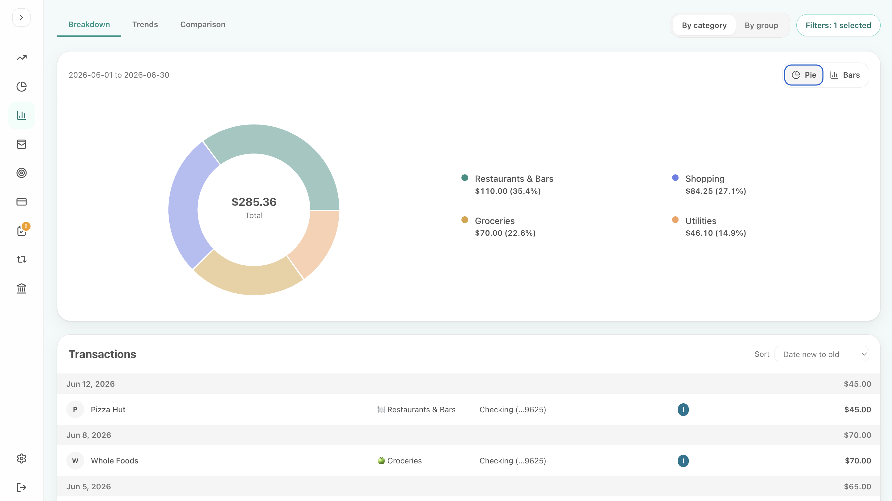
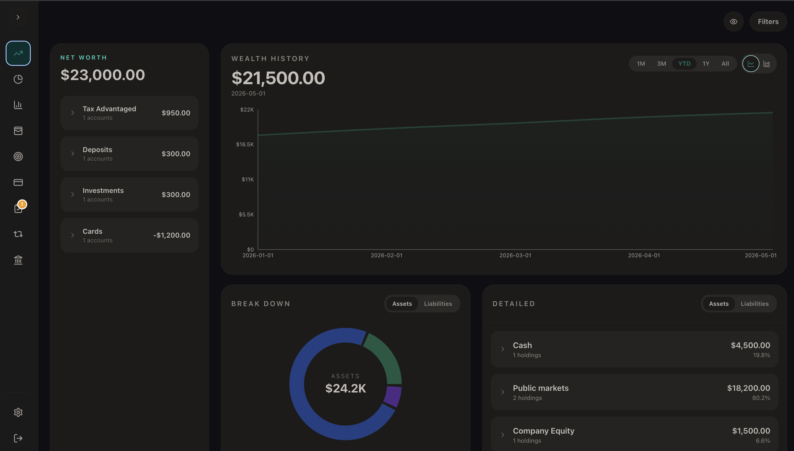
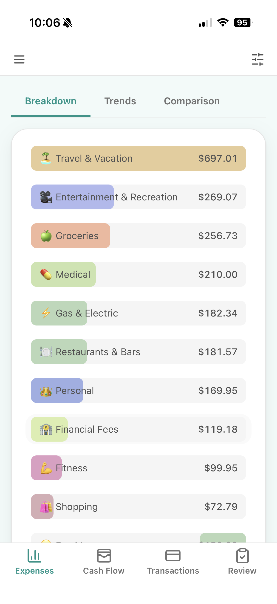
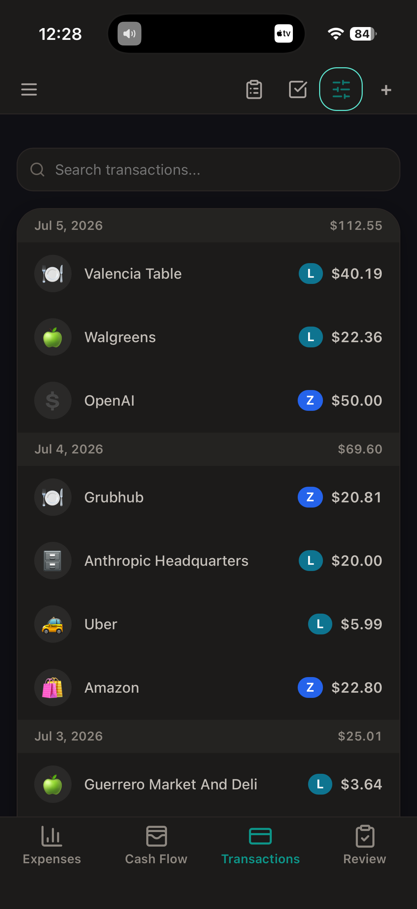

<h1 align="center">Tallyo</h1>

<p align="center">Self-hosted personal finance tracker for your household. Supports Desktop and mobile PWA.</p>

<p align="center">
  <a href="https://github.com/orlandoc01/tallyo/actions/workflows/ci.yml"></a>
  <a href="https://github.com/orlandoc01/tallyo/releases"></a>
  <a href="https://github.com/orlandoc01/tallyo/pkgs/container/tallyo"></a>
  <a href="LICENSE"></a>
</p>

<p align="center">
  
</p>
<p align="center">
  
</p>

## Features

- 💰 **All-in-one spending and net worth tracker** — transactions, recurring charges, cash flow, budgets, investment portfolio, and historical net worth in one app
- 🏦 **Bank integrations with Plaid and SimpleFIN** — automatic transaction, balance, and holdings sync from thousands of institutions
- 📈 **Yahoo Finance pricing and asset classification** — live security quotes plus portfolio breakdowns by composition, Morningstar category/group, and sector
- 🪙 **Crypto wallet tracking with DeBank** — paste an EVM address to track token balances across chains; no API key required
- 🎯 **Budget tracking** — monthly budgets vs. actuals with history and copy-forward
- 🔐 **Secure Protection** — built-in OAuth 2.1 + PKCE authorization server with Google Sign-In, email OTP/magic links, passkeys, and role-based access control. Optional database encryption for all financial data
- 🤖 **MCP plugin** — connect AI assistants to your finances over the Model Context Protocol, gated by the same authorization mechanisms as the API

## Table of Contents

- [How It Works](#how-it-works)
- [Installation](#installation)
  - [Docker (recommended)](#docker-recommended)
  - [Bare metal (release binary)](#bare-metal-release-binary)
  - [Build from source](#build-from-source)
  - [Environment variables](#environment-variables)
- [First-Run Setup](#first-run-setup)
  - [Install as a PWA](#install-as-a-pwa)
- [Connecting Your Accounts](#connecting-your-accounts)
  - [Plaid (free trial, 10 connections)](#plaid-free-trial-10-connections)
  - [SimpleFIN](#simplefin)
  - [Crypto wallets (DeBank)](#crypto-wallets-debank)
  - [Manual accounts, real estate, and CSV](#manual-accounts-real-estate-and-csv)
- [AI Transaction Categorization](#ai-transaction-categorization)
  - [Ollama (local model)](#ollama-local-model)
- [MCP Plugin](#mcp-plugin)
- [OAuth Scopes and Roles](#oauth-scopes-and-roles)
- [GraphQL API](#graphql-api)
- [Security](#security)
- [Repository Layout](#repository-layout)
- [Contributing](#contributing)
- [License](#license)

## How It Works

Tallyo ships as a single `tallyo` binary with the web app embedded. It runs background sync loops (Plaid, SimpleFIN, crypto wallets, prices), stores everything in a local SQLite database, and serves a GraphQL API plus the SPA over one HTTP port. Runtime settings can disable transaction or wealth tracking; those toggles hide matching UI and pause the corresponding backend pollers. There is no external database, cache, or message queue to operate.

Tallyo is built for household-scale self-hosting. Run it behind your own reverse proxy, VPN, or identity-aware proxy — do not expose it directly to the public internet. See [Security and Deployment Notes](docs/security.md) before publishing an instance.

**Plaid is optional.** SimpleFIN sync, CSV import/export, crypto wallet tracking, and manual accounts (including real estate and manual holdings/liabilities) all work without a Plaid account, so you can track spending and net worth entirely without it.

That said, most features have been tested with Plaid credentials. Anyone in the US and Canada can now signup for a free Plaid account and get [10 free logins/connections](https://support.plaid.com/hc/en-us/articles/39994173227159-What-is-the-Plaid-Trial-plan), which should be enough for most households to track their finances (note: you can configure more credentials in the app if other household members also sign up for their own). The SimpleFIN integration can also pull transactions for expense tracking, though categorization support is more limited, as is investment holding analysis.

## Installation

### Docker (recommended)

Create a `compose.yml` file. Pin `<full-version>` for persistent deployments; use `latest` only when you intentionally want the newest release:

```yaml
services:
  tallyo:
    image: ghcr.io/orlandoc01/tallyo:<full-version>
    restart: unless-stopped
    # substitute below with your own uid/gid
    user: "1000:1000" 
    ports:
      - "127.0.0.1:8080:8080"
    volumes:
      - tallyo-data:/data

volumes:
  tallyo-data:
```

```bash
docker compose up -d
```

Open `http://127.0.0.1:8080` and complete setup before making the service reachable from another machine. The image runs as a nonroot user, and fresh named volumes require no ownership preparation. Bind mounts must be writable by container UID/GID `65532`, or run the container as your own user (`--user "$(id -u):$(id -g)"`, compose `user:`) so created files are owned by you — see [docs/install.md](docs/install.md).

Or a plain `docker run`:

```bash
docker volume create tallyo-data
docker run -d --name tallyo --restart unless-stopped \
  -p 127.0.0.1:8080:8080 \
  -v tallyo-data:/data \
  --user "$(id -u):$(id -g)" \
  'ghcr.io/orlandoc01/tallyo:<full-version>'
```

Multi-arch images (amd64/arm64) are published for every release, tagged `latest`, `vX.Y`, and the full version.

For remote-host bootstrap, reverse proxies, database encryption, and bare-binary service setup, see [Installing Tallyo](docs/install.md).

### Bare metal (release binary)

Every release publishes standalone archives for Linux and macOS (amd64 and arm64) and Windows (amd64), with SHA-256 checksums and SBOMs. Download the archive for your platform from the Releases page, extract it, and run the `tallyo` binary — the web app is embedded, and no CGO or external SQLite is needed:

```bash
tar -xzf tallyo_<version>_linux_amd64.tar.gz
DB_PATH=./tallyo.db \
./tallyo
```

`DB_PATH` defaults to `/data/tallyo.db` (the Docker volume path), so set it explicitly on bare metal.

### Build from source

Using the Go toolchain from `server/go.mod`, Node 24, and npm 11:

```bash
cd web && npm ci && npm run build && cd ..
make -C server sync-web
cd server && go build -trimpath -o tallyo ./cmd/tallyo
```

The root `Dockerfile` packages binaries produced by GoReleaser; it does not build a clean source checkout directly.

### Environment variables

Only a small set of env vars exists — everything else (auth methods, integrations, MCP, LLM) is configured at runtime through the app.

| Variable | Default | Description |
|----------|---------|-------------|
| `DB_PATH` | `/data/tallyo.db` | SQLite database file path |
| `DB_ENCRYPTION_KEY` | *(empty)* | Optional at-rest encryption key (64 hex chars, e.g. `openssl rand -hex 32`) |
| `DB_ENCRYPTION_KEY_FILE` | *(empty)* | File containing the key; takes precedence over `DB_ENCRYPTION_KEY` |
| `DB_WARN_FULL_SCANS` | `false` | Restart-required SQLite diagnostic warning on actual full scans and automatic transient indexes |
| `PORT` | `8080` | HTTP listen port |
| `CONFIG_FILE_PATH` | *(empty)* | Optional YAML config file for all env vars |
| `SYNC_OFF` | `false` | Skip starting background sync loops; manual sync actions still run |
| `MASTER_PASSWORD` | *(empty)* | Bootstrap/admin auth; grants all scopes. Env overrides DB value set during setup |
| `DISABLE_ALL_AUTH` | `false` | Local development only; refuses non-loopback issuers |

## First-Run Setup

1. Start the server and open `http://localhost:8080`. Optionally set a strong `MASTER_PASSWORD` in the environment to protect the setup wizard from the first request.
2. Choose a master password, OAuth sign-in, or both. Authentication can also be changed later under **Settings -> Security**.
3. If configuring OAuth, set your OAuth issuer URL and redirect URIs, then enable the sign-in methods you want: Google Sign-In, email OTP/magic links, and/or passkeys. Keeping only the master password is also valid for a single-user install.
4. Configure household owners whose spending and accounts are tracked. You may also store Plaid credentials or claim a SimpleFIN token; Plaid account linking happens afterward under **Accounts -> Link Connection**.
5. Invite additional household members from **Settings → Access** — each user gets a role that controls what they can see and change (see [OAuth Scopes and Roles](#oauth-scopes-and-roles)).

When Tallyo runs behind a reverse proxy or tunnel, perform OAuth/passkey setup through the final HTTPS origin. The OAuth issuer URL, frontend redirect URIs, WebAuthn settings, and Google Cloud authorized redirect URI must match that origin. See [Authentication](docs/auth.md) and [Reverse Proxy](docs/reverse-proxy.md).

### Install as a PWA

The web app is a full PWA: installable, auto-updating, with app icons, standalone display, and customizable navigation bar in settings. Financial data is never cached offline — API calls always hit the network.

<p align="center">
  
  
</p>

- **Desktop (Chrome/Edge):** click the install icon in the address bar, or menu → *Install Tallyo*.
- **Android (Chrome):** menu → *Add to Home screen* / *Install app*.
- **iOS (Safari):** Share → *Add to Home Screen*.

## Connecting Your Accounts

**Accounts → Link Connection/ Add** offers Plaid, SimpleFIN, crypto wallets, manual accounts, and real estate. Each connection is assigned an owner so multi-person households can filter by person.

### Plaid (free trial, 10 connections)

Plaid's free production trial supports up to 10 live bank connections, which should be enough for most households. It's highly recommended to use this for best transaction sychronization and investment analysis of your accounts

1. Sign up at [dashboard.plaid.com](https://dashboard.plaid.com) and request Production access (the free trial tier).
2. Copy your client ID and secret, and add them in Tallyo under **Settings → Connections** as a Plaid credential. Multiple credentials are supported.
3. **Accounts → Link Connection** launches Plaid Link to connect a bank.

Transactions sync incrementally via Plaid's `/transactions/sync`, arrive pre-categorized through Plaid's personal finance categories, and recurring charges are detected automatically. Sync timing is a per-item cron schedule you can edit in the UI (default: transactions twice daily, recurring detection weekly).

### SimpleFIN

[SimpleFIN Bridge](https://bridge.simplefin.org) is a low-cost (~$1.50/month) read-only aggregator. Note that investment holdings support is still very limited at the moment

1. Create a SimpleFIN Bridge account and connect your institutions there.
2. Generate a one-time **Setup Token** and paste it into Tallyo's **Add account → SimpleFIN** form. Tallyo claims the token and stores the resulting access URL (write-only — it is never exposed back out of the API).
3. Balances, transactions, and investment holdings sync on a schedule.

SimpleFIN does not provide transaction categories, so pair it with [AI categorization](#ai-transaction-categorization) below to automate transaction categorization or with the [MCP Plugin](#mcp-plugin) to have an external agent categorize it for you.

### Crypto wallets (DeBank)

**Accounts -> Link Connection → Crypto wallet**, paste an EVM address (`0x…`), pick at least one chain, and optionally label it. Tallyo tracks token balances on the selected chains via DeBank's public API and folds their USD value into net worth. Change the selected chains later from the account detail form. Read-only, address-only — no keys, no signatures.

### Manual accounts, real estate, and CSV

Accounts at institutions without an aggregator can be tracked manually: 

* manual holdings and liabilities with balance snapshots taken daily using Yahoo Ticker Pricing
* real estate with valuation history
* CSV import/export for transactions (`POST /transactions/import`, `GET /transactions/export`).

## AI Transaction Categorization

Tallyo can use an LLM as the final categorization tier: merchant rules apply first, then Plaid's category mapping, then the LLM for whatever is left.

- **Recommended if you use SimpleFIN** — SimpleFIN transactions arrive uncategorized, so the LLM does the heavy lifting.
- **Not needed for Plaid** — Plaid transactions are already categorized by its personal finance category mapping.

Configure a local [Ollama](https://ollama.com) instance under **Settings → AI Integration**. The prompt is grounded with few-shot examples drawn from your own confirmed transaction history, and only high/medium-confidence results are applied — low-confidence transactions stay in the review queue for manual categorization.

### Ollama (local model)

Set the Ollama URL (e.g. `http://localhost:11434`) and the model you've pulled. Everything runs against your own Ollama instance; no transaction data leaves your network.

## MCP Plugin

Tallyo exposes an MCP server at `/mcp` so AI assistants can query and manage your finances with the same authorization model as the UI:

- Disabled by default; an admin enables it under **Settings → AI Integration → MCP** (`/mcp` returns 404 until then).
- With OAuth enabled, MCP clients self-register via OAuth dynamic client registration (`POST /register`) and always go through an explicit consent screen.
- Granted scopes are the intersection of what the client requests and the signed-in user's role — a `readonly` user's assistant cannot write.
- Allowed Redirect Hosts **MUST** be supplied and comma-separated if using OAuth with MCP registration (ex: `claude.ai` for Claude, `chatgpt.com` for OpenAI)
- Can also use an Authorization header with `X-Api-Key:$MASTER_PASSWORD` if relying solely on Master Password signin without Oauth

## OAuth Scopes and Roles

Tallyo embeds its own OAuth 2.1 authorization server (PKCE required, ES256 JWTs, rotating refresh tokens). Every API operation requires a scope of the form `read:<resource>` or `write:<resource>`, declared directly in the GraphQL schema with `@requiresScope` — the single source of truth enforced for GraphQL, REST, and MCP alike.

> **Note:** All of this applies only if you enable an OAuth sign-in method (Google, email OTP, or passkeys) in Settings and invite users. If you rely solely on the master password, none of it applies — master-password sessions always receive every scope.

Resources: `transactions`, `accounts`, `users`, `rules`, `categories`, `owners`, `assets`, `wealth`, `budgets`, `tags`, `settings`, plus read-only `spending`, `cashflow`, and `portfolio`.

Each user has a role that maps to a scope set:

| Role | Access |
|------|--------|
| `admin` | Everything, including users and settings |
| `writer` | Read/write everything except user and settings management |
| `readonly` | Read-only view of transactions, accounts, reports, wealth, and portfolio |
| `spend_tracker` | Spending reports only (no raw transaction access) |
| `cashflow_tracker` | Spending + cash flow reports and budget editing only (no raw transaction access) |
| `net_worth_tracker` | Net worth, assets, and manual holdings (read/write) |
| `portfolio_tracker` | Portfolio analysis only |

The frontend hides navigation and controls based on the JWT's scopes; the backend re-enforces them on every request regardless.

## GraphQL API

The API is schema-first GraphQL served at `POST /query` (an authenticated playground lives at `/playground`). The schema is split by domain under [`schema/`](schema/):

| File | Domain |
|------|--------|
| `base.graphql` | Scalars (`Date`, `DateTime`), directives, shared primitives |
| `transactions.graphql` | Transactions, categories, rules, spending, cash flow, recurring |
| `accounts.graphql` | Accounts, connections (Plaid / SimpleFIN / EVM wallets), owners, link flow |
| `wealth.graphql` | Assets, holdings, snapshots, net worth, manual holdings/liabilities, wealth-owned Account extensions |
| `budgets.graphql` | Budgets and budget reports |
| `portfolio.graphql` | Portfolio analysis views (composition, Morningstar category/group, sectors) |
| `admin.graphql` | Users, roles, runtime configuration |

Schema conventions worth knowing:

- Every query/mutation takes at most one argument — a scalar or a single `{Op}Input` object.
- List queries return envelope types (`{ items: [...] }`) rather than bare arrays.
- `transactions` uses Relay-style cursor pagination.
- Connections are polymorphic: `union ConnectionProvider = PlaidItem | EVMWallet | SimpleFinConnection`.
- Wealth-owned account extensions use explicit names, e.g. `accountWealthProperty`, even when attached to `Account`.
- Every root field carries `@requiresScope(scope: "...")`.

CSV import/export are the two REST exceptions: `POST /transactions/import` and `GET /transactions/export` (the export accepts all transaction filters as query parameters).

## Security

The SQLite database contains bank access tokens, OAuth refresh tokens, and the JWT signing key — treat the file and its backups as secrets. Highlights:

- Optional at-rest database encryption (`DB_ENCRYPTION_KEY` / `DB_ENCRYPTION_KEY_FILE`).
- PKCE-only OAuth, short-lived ES256 access tokens, refresh-token rotation with replay detection, per-IP rate limits.
- Configurable trusted-proxy CIDRs so rate limiting sees real client IPs behind a reverse proxy.

Read [docs/security.md](docs/security.md) before deploying, and see [SECURITY.md](SECURITY.md) for reporting vulnerabilities.

## Repository Layout

| Path | Description |
|------|-------------|
| [`server/`](server/README.md) | Go server: GraphQL API, OAuth, sync loops, MCP, embedded SPA |
| [`web/`](web/README.md) | React/TypeScript SPA + PWA |
| [`schema/`](schema/) | Shared GraphQL schema, split by domain |
| [`docs/`](docs/security.md) | Security and deployment notes |
| `Dockerfile` | Release image for GoReleaser-built binaries |

## Contributing

Development setup, testing, and conventions live in the subsystem READMEs: [server/README.md](server/README.md) and [web/README.md](web/README.md). CI runs typecheck, lint, and coverage-gated tests for both subsystems on every PR. Commit messages in the `feat:` / `fix:` style are grouped into release changelogs.

## License

Tallyo is licensed under the [Apache License, Version 2.0](LICENSE).
